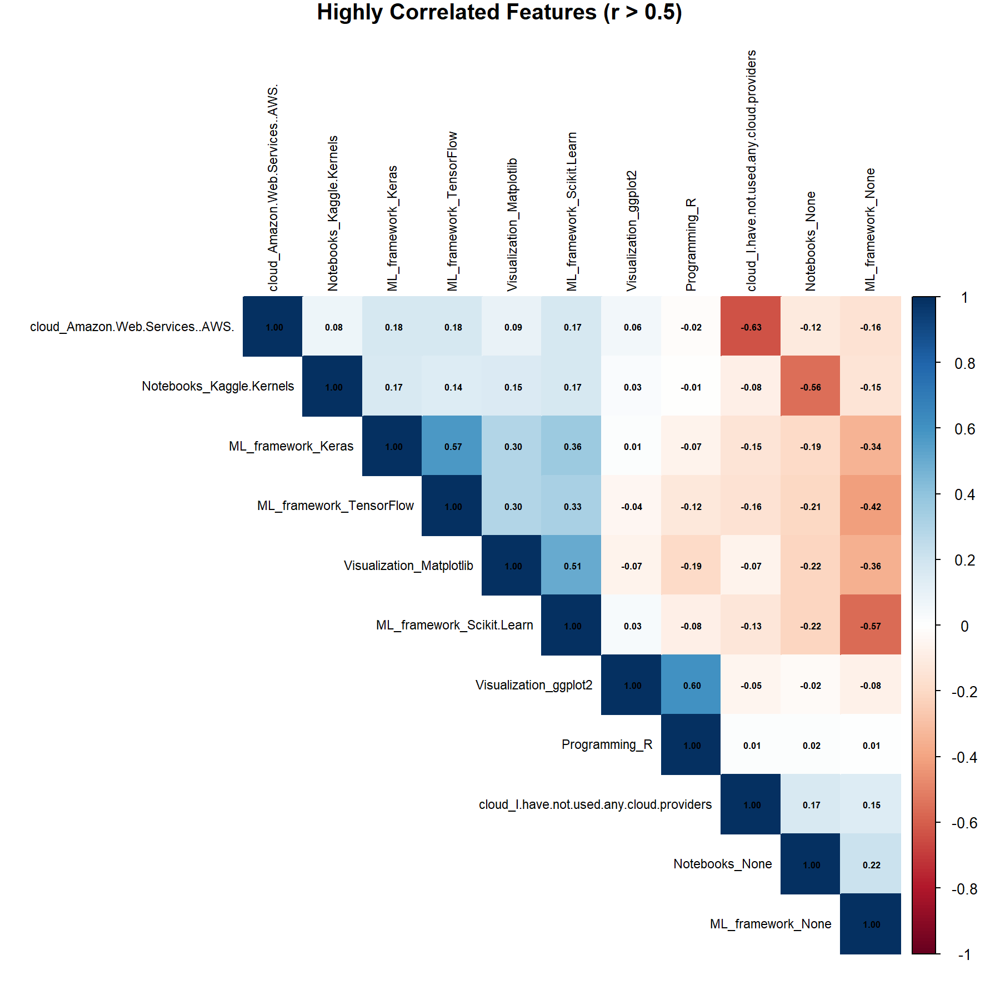

# Introduction
The purpose of this project is to develop a predictive model that estimates individual wages based on a wide range of personal, educational, and professional characteristics. Using the dataset data_wage.RData, our goal is to apply supervised learning techniques to accurately predict the variable of interest, which is the wage.

Beyond predictive accuracy, a key focus of this project is on Explainable Artificial Intelligence (XAI). While machine learning models can uncover complex patterns and deliver powerful predictions, they often operate as black boxes. This raises critical concerns about transparency, fairness, and trust. XAI methods help address these challenges by making model behavior interpretable and understandable. In this project, we will apply explainability techniques to identify the key factors driving wage predictions.

We will guide you through the entire process, starting with data exploration and cleaning, followed by model training and testing, and finally using the model to estimate the future salaries of our group members.

# Load and prepare the data
We start by loading the original dataset data_wage.RData. To ensure a clear workflow, we rename the dataset to data_original and remove the old variable name to avoid confusion in the following steps.

```{r setup, include=FALSE}
knitr::opts_chunk$set(echo = TRUE)

# Load libraries
library(writexl)
library(readxl)
library(knitr)
library(dplyr)
library(tibble)
library(ggplot2)
library(corrplot)
library(h2o)

# Load the data
load("data_wage.RData")

# Rename 
data_original <- data
rm(data)                 # Remove the name `data` 

```

Since one objective of this project is to use our predictive model to estimate the future wages of our own group members, we will export the original dataset into an editable Excel file. Each team member will then manually create a new row by answering the same set of questions included in the dataset, based on their personal background, education, experience, and other relevant characteristics.

This method allows us to maintain consistency with the dataset’s structure and ensures that our self-assessed entries are in the correct format. 

```{r export csv file to data, echo=FALSE, warning=FALSE, message=FALSE}

# Export to Excel
write_xlsx(data_original, "data_wage_editable.xlsx")

```

Now that all team members have completed their entries, we re-imported the updated Excel file. These additional rows are now part of the dataset and will be included in our analysis and model development moving forward.

```{r upload filled excel file, echo=FALSE, warning=FALSE, message=FALSE}

# Read the filled-in Excel file
data <- read_excel("data_wage_filled.xlsx")

```

# Data Exploration
We begin our analysis with an initial exploration of the dataset to understand its structure and contents. This step is essential to get a sense of the data we're working with and to identify any immediate issues that may need attention.

## Dimensions of the dataset
As a first step, we examine the dimensions of the dataset data, which now includes both the original survey responses and the additional entries created by our team members. Understanding the number of observations and variables provides a foundation for all further analysis.

```{r dimensions, echo=FALSE, warning=FALSE, message=FALSE }

dim(data)

```

The dataset consists of 10'813 observations and 78 variables. This includes the original 10'809 responses from the survey as well as 4 additional rows that were added manually by our team members. Each observation represents one individual and the variables capture various demographic, educational, and professional characteristics relevant to wage prediction.

## First and last few rows
To get a sense of the structure and format of our dataset, we display the first and last few rows. Given that the dataset includes 78 variables, we only show a small selection of rows and columns to maintain readability.

```{r head, echo=FALSE, warning=FALSE, message=FALSE}

# Show first 5 rows and first 10 variables
kable(
  head(data[, 1:10], 5),
  caption = "First 5 Rows (First 10 Variables)"
)

```

Looking at the first few rows, some striking patterns immediately jump out — and not by coincidence. The first four entries all come from Switzerland, represent the 22–24 age range, and hold a Bachelor's degree in Mathematics or Statistics. They’re either aspiring Data Analysts or Data Scientists, and every one of them is a student with 0–1 years of experience. 

In short, it’s not hard to guess: these are us. 

Further we can notice that the last column shown in this preview is a one-hot encoded variable that indicates whether someone is involved in this specific ML-related activity.

```{r tail, echo=FALSE, warning=FALSE, message=FALSE}

# Show last 5rows and first 10 variables
kable(
  tail(data[, 1:10], 5),
  caption = "Last 5 Rows (First 10 Variables)"
)


```

At the other end of the dataset, the last five rows bring us back to the diversity of the original survey respondents. Here we see individuals from countries like Turkey, India, Russia, the Netherlands, and France. Their backgrounds are just as varied — ranging from fresh graduates to seasoned professionals with over 20 years of experience. This variety highlights the richness of the dataset and the breadth of real-world contexts it captures — which will be crucial for building a model that generalizes well.

## Structure of the dataset
To better understand the makeup of our dataset, we begin by inspecting the structure of the variables. With 78 variables in total, a full printout using str(data) would be too lengthy and clutter the markdown output. Instead, we limit the preview to the first 9 variables, which gives us a clear sense of how the dataset is structured without overwhelming the document.

```{r structure, echo=FALSE, warning=FALSE, message=FALSE }

str(data[, 1:9])

```

The structure preview of the first 9 variables reveals that all of them are currently stored as character data types (chr). This is important to note because many of these variables — such as gender, education, and job_role — are clearly categorical in nature. Before we can use them in a predictive model, we will need to convert them into appropriate formats, such as factors or one-hot encoded variables. This observation highlights the need for a careful and thoughtful preprocessing phase, especially for handling categorical data correctly.

In addition to this partial structure, we summarize the data types of all variables in the dataset. This overview helps us identify how many variables are categorical, numeric, logical, or of other types.

```{r summarize data types, echo=FALSE, warning=FALSE, message=FALSE }

# Count variable types
table(sapply(data, class))

```

This output tells us that the dataset contains 14 character variables and 64 numeric variables. The high number of numeric variables suggests that many features are already in a format suitable for modeling, which is convenient. However, the 14 character variables will require transformation. These are likely to include key predictors such as demographic information, education level, job role, or region — all of which may play an important role in wage prediction.

This breakdown gives us a solid foundation for planning our preprocessing pipeline in the next steps.

# Data Quality Issues 
Before diving into feature selection and model building, it is essential to assess the quality of the dataset. High-quality data is the foundation of any reliable predictive model. In this section, we systematically check for common data quality issues such as missing values, inconsistent formatting, or variable types that may require transformation.

Identifying and addressing these issues early on ensures that the subsequent steps are built on clean and trustworthy data

## Completeness
One of the first aspects to assess when evaluating data quality is completeness. Specifically, whether there are any missing values (NAs) in the dataset. Missing values can negatively impact the performance of machine learning models and must be handled appropriately before training.

To investigate completeness, we inspect the dataset for the presence of missing values.

```{r completeness, echo=FALSE, warning=FALSE, message=FALSE }

# Total number of missing values in the dataset
sum(is.na(data))

```

The dataset contains 4 missing values. Let’s identify which variable they belong to.

```{r completeness - number of missing values, echo=FALSE, warning=FALSE, message=FALSE }

# Number of missing values per variable
na_counts <- colSums(is.na(data))
na_counts[na_counts > 0]  # Show only variables with missing values

```

These missing values are all located in the wage variable and correspond to the four manually added rows from our group members. We intentionally left the wage field blank, as these entries are meant to serve as test cases for our final model predictions. This makes perfect sense from a project perspective.

**What to Do with These NA Wages?**
To ensure a clean and consistent dataset for model training, we extract all observations where the wage value is missing (NA) into a new dataset named data_team. These rows represent the entries from our team members and are excluded from the training data.

After this separation, we remove these rows from the main dataset (data). The result is a dataset that contains only the original survey responses, all of which are complete and contain no missing values. This allows us to proceed with confidence, knowing that our training data is fully intact and suitable for building a reliable predictive model.

```{r completeness - extract missing values, echo=FALSE, warning=FALSE, message=FALSE }

# Extract rows with NA in wage (our own entries)
data_team <- data %>% filter(is.na(wage))

# Remove these rows from the main dataset
data <- data %>% filter(!is.na(wage))

```

## Duplicates
Another important step in assessing data quality is checking for duplicate rows. Duplicate entries can bias model training by overrepresenting certain individuals or responses, potentially skewing the predictions. Especially in survey data, it’s important to ensure each response represents a unique individual.

In this section, we check whether the dataset contains any exact duplicates.

```{r duplicates, echo=FALSE, warning=FALSE, message=FALSE }

# Check for duplicate rows
sum(duplicated(data))

```

The output shows that there are 0 duplicate rows in the dataset. This confirms that each observation in the dataset is unique, and no duplicate responses are present. 

## Data Consistency
Before we can train any reliable machine learning model, we need to ensure that the data is not only complete but also internally consistent. Data consistency refers to making sure that each variable is stored in the correct format, contains coherent values, and is structured in a way that models can properly interpret.

In this step, we focus on aligning data types with their intended use  and checking for inconsistencies in how categories are recorded. 

### Convert Categorical Variables to Factors
In this step, we ensure that all categorical variables in the dataset are consistently and correctly formatted by converting them from character type to factor type. This is important because many of our variables — such as gender, education, or job role — represent distinct categories rather than free text. 

In R, treating these variables as factors allows machine learning models to correctly interpret them as discrete, non-numeric values with specific levels. This distinction is essential for algorithms like decision trees or random forests, which can leverage the factor structure directly. 

We perform this transformation using a simple and efficient command that automatically converts all character variables in the dataset into factors.

```{r convert categorical variables to factors, echo=FALSE, warning=FALSE, message=FALSE}

# Convert all character variables to factors
data <- data %>%
  mutate(across(where(is.character), as.factor))

# Count variable types
table(sapply(data, class))

```

All categorical variables have now been successfully converted into factors, ensuring that they are properly recognized and handled as discrete categories in the modeling process.

### Standardize inconsistent values
Before moving on to modeling, we take a moment to ensure that all factor levels are consistent and free from redundant or misformatted entries. In survey data, it's common to encounter small inconsistencies — for example, the same category entered with different capitalizations or spellings.

```{r standardize, echo=FALSE, warning=FALSE, message=FALSE }

# Extract factor variables
factor_vars <- data[, sapply(data, is.factor)]

# Create a list of factor levels
levels_list <- lapply(factor_vars, levels)

# Convert to a named data frame for display
levels_table <- tibble(
  Variable = names(levels_list),
  Levels = sapply(levels_list, function(x) paste(x, collapse = ", "))
)

# Display as a kable table
kable(levels_table, caption = "Levels of All Factor Variables")

```

**Interpretation: ** After inspecting the levels of all factor variables, we found no noteworthy inconsistencies. All categorical values appear to be consistently formatted, and no duplicates caused by differences in capitalization or spelling were detected. Therefore, no adjustments to the factor levels were necessary.

## Outliers
Outliers are data points that deviate significantly from the overall distribution of a variable. For instance, an individual reporting a salary that is ten times higher than the average, would be considered outliers. These extreme values can distort model estimates, influence summary statistics, and influence model performance, especially in regression-based methods. Therefore, it is crucial to detect and assess such values before proceeding with model development.

Since our target variable is wage, this is the primary variable of concern when checking for outliers. We begin by visualizing the wage distribution to detect any extreme values.

```{r outliers wage plot, echo=FALSE, warning=FALSE, message=FALSE }

# Boxplot showing wage distribution with outliers
ggplot(data, aes(y = wage)) +
  geom_boxplot(fill = "lightblue", outlier.shape = 16) +
  labs(
    title = "Boxplot of Wage",
    y = "Wage (USD)"
  )


```

**Interpretation: **We can see that we do have some outliers in the wage variable, as expected. Let’s now examine how many observations fall outside the typical range.

To identify outliers, we use the Interquartile Range (IQR) rule, a standard method for detecting extreme values in continuous data. The IQR is the difference between the third quartile (Q3) and the first quartile (Q1). Outliers are defined as values that fall below Q1 - 1.5 × IQR or above Q3 + 1.5 × IQR. The table below shows how many observations in our dataset meet this condition. TRUE indicates an observation is classified as an outlier. FALSE means the observation lies within the normal range and is not an outlier.

```{r outliers wage table, echo=FALSE, warning=FALSE, message=FALSE }

# Calculate IQR thresholds
Q1 <- quantile(data$wage, 0.25)
Q3 <- quantile(data$wage, 0.75)
IQR_value <- Q3 - Q1

lower_bound <- Q1 - 1.5 * IQR_value
upper_bound <- Q3 + 1.5 * IQR_value

# Flag outliers
data$outlier_flag <- ifelse(data$wage < lower_bound | data$wage > upper_bound, TRUE, FALSE)

# Count outliers vs non-outliers
table(data$outlier_flag)

```

Based on the IQR rule, a total of 275 observations have been identified as outliers in the wage variable. Given that this number is relatively small compared to the 10,534 non-outlier observations, we decide to remove these outliers from the dataset. This approach ensures that our model is trained on clean and representative data, without being influenced by extreme wage values that could distort predictions.

```{r outliers wage remove, echo=FALSE, warning=FALSE, message=FALSE }

# Remove wage outliers from the dataset
data <- data %>% filter(outlier_flag == FALSE)

# Count outliers vs non-outliers
table(data$outlier_flag)

#Remove the outlier_flag column
data$outlier_flag <- NULL


```
As shown in the table above, all outliers have been successfully removed from the dataset. The only remaining entries are those labeled FALSE, confirming that no outliers are present in the wage variable anymore.

As the other variables in the dataset are all either of type factor or numeric, no further outlier treatment is necessary. Outlier detection is only relevant for continuous numeric variables. All factor variables represent categorical information and therefore do not require outlier handling. The remaining numeric variables are exclusively one-hot encoded (0/1) indicators derived from multiple-choice survey questions. Since these variables are binary by nature, they cannot contain outliers and are excluded from further outlier analysis.

## Investigate the target variable
Before building our model, we explore the distribution and characteristics of the target variable wage. This helps us understand its range, detect anomalies, and ensure it's suitable for predictive modeling.

The summary provides basic descriptive statistics of the wage variable, including the minimum, maximum, mean, median, and quartiles. It helps identify unusual values and assess the scale and spread of the variable.

```{r summary wage, echo=FALSE, warning=FALSE, message=FALSE}

summary(data$wage)

```

The histogram, overlaid with a density curve, shows the overall distribution of wage values in the dataset. It allows us to visually assess skewness and the presence of any prominent peaks or gaps.

```{r histogram wage, echo=FALSE, warning=FALSE, message=FALSE }


ggplot(data, aes(x = wage)) +
  geom_histogram(binwidth = 5000, fill = "steelblue", color = "white") +
  geom_density(aes(y = ..count.. * 5000), color = "red", linewidth = 1) +
  labs(title = "Distribution of Wage", x = "Wage (USD)", y = "Count")

```

**Interpretation: ** The distribution of wage values is right-skewed, meaning most individuals earn on the lower end of the spectrum, while fewer earn extremely high wages. This is common in real-world income data and indicates a long tail of high earners. The density curve also shows some bumps in the higher income range, potentially reflecting common salary brackets or reporting artifacts.

This skewness suggests that models should be robust to such imbalances and that error metrics sensitive to large deviations (like RMSE) may be particularly affected by high-income outliers.

Further, we observe that a number of respondents have a wage value of 0. These entries do not provide meaningful target values for model training, as no income is recorded. Since our goal is to predict actual wage values, we remove these cases from the dataset.

```{r remove wage equal 0, echo=FALSE, warning=FALSE, message=FALSE}

# Remove observations where wage equals 0
data <- data %>% filter(wage > 0)


```

## Standardization
In our dataset, all features are either categorical variables stored as factors or already one-hot encoded numeric variables (binary 0/1 indicators). Therefore, feature scaling or standardization is not required.

Standardization is typically applied to continuous numeric variables to ensure they are on a comparable scale, especially when using models that are sensitive to feature magnitude (e.g., linear regression, support vector machines, or K-nearest neighbors). However, this is not the case in our setup.

Furthermore, since we plan to use tree-based algorithms for prediction (such as decision trees, random forests, or gradient boosting), standardization would have no effect on model performance. 

As a result, we proceed without applying any feature scaling, as all variables are already in a format suitable for modeling.

# Correlation Matrix
Before proceeding with model training, we first examine the correlation between features in our dataset. This step is particularly important given our ultimate objective of applying explainability techniques such as SHAP, LIME, or Partial Dependence Plots (PDP). These methods, while widely used, generally assume that input features are independent — a condition that is rarely fully met in real-world data. Ignoring feature dependence can lead to misleading or biased interpretations when assessing model behavior.

To proactively address this limitation, we analyze the correlations among all numeric features. Identifying highly correlated variables early on helps us understand potential redundancies in the dataset and prepares us to better interpret explainability outputs later in the process.

```{r correlation matrix, echo=FALSE, warning=FALSE, message=FALSE}

# Subset only numeric variables (one-hot encoded features)
numeric_data <- data %>% select(where(is.numeric))

# Compute the correlation matrix
cor_matrix <- cor(numeric_data, use = "pairwise.complete.obs")

# Extract only pairs with moderate to high correlation (> 0.5 and < 1)
high_corr <- which(abs(cor_matrix) > 0.5 & abs(cor_matrix) < 1, arr.ind = TRUE)
high_corr_vars <- unique(c(rownames(cor_matrix)[high_corr[, 1]], 
                           colnames(cor_matrix)[high_corr[, 2]]))

# Save plot if there are high correlations
if (length(high_corr_vars) >= 2) {
  cor_matrix_filtered <- cor_matrix[high_corr_vars, high_corr_vars]
  
  # Save as PNG
  invisible({
  png("correlation_plot.png", width = 1800, height = 1800, res = 200)
  corrplot(cor_matrix_filtered, method = "color", type = "upper", 
           addCoef.col = "black", number.cex = 0.5,
           tl.cex = 0.7, tl.col = "black", order = "hclust",
           mar = c(0, 0, 1, 0), title = "Highly Correlated Features (r > 0.5)")
  dev.off()
 })
}




```

**Interpretation:**
Several numeric (one-hot encoded) features show moderate positive correlations (r > 0.5), indicating overlapping patterns in respondent behavior. For instance, `ML_framework_Keras` and `ML_framework_TensorFlow` show a correlation of 0.57, which is expected given that Keras often runs on top of TensorFlow. Likewise, `Visualization_ggplot2` and `Programming_R` are strongly correlated (r = 0.60), reflecting the fact that ggplot2 is a core component of the tidyverse and commonly used in R-based workflows.

We also observe a correlation of 0.51 between `Visualization_Matplotlib` and `ML_framework_Scikit.Learn`, both of which are commonly used tools within the Python ecosystem.

In contrast, several negative correlations emerge between “None” or “Not used” options and the corresponding tool usage. For example, cloud_I.have.not.used.any.cloud.providers is strongly negatively correlated with cloud_Amazon.Web.Services..AWS. (r = -0.63), as respondents who have never used any cloud providers logically did not use AWS. Similarly, Notebooks_None is negatively correlated with Notebooks_Kaggle.Kernels (r = -0.56), and ML_framework_None with ML_framework_Scikit.Learn (r = -0.57). These relationships are expected and reflect mutual exclusivity. selecting "None" implies not selecting any specific tool from that category.

**Conclusion:**
These features are not perfectly correlated, so we do **not** drop them from the dataset. However, we keep in mind that they contain overlapping information, which may influence the behavior of certain explainability techniques (e.g., SHAP or LIME). We will retain these features for now but consider their relationship during the model interpretation phase.

### Decision on Feature Grouping
At this stage, we have decided not to group variables within broader categories (e.g., programming languages, cloud platforms, ML frameworks). While grouping could simplify the model and enhance interpretability, it also carries the risk of losing valuable individual-level information. For instance, some programming languages or tools might be associated with higher wage levels, while others might correlate with lower wages. Grouping them prematurely would mask these potentially important distinctions.

Instead, we will first proceed with the full set of individual variables and move on to model selection and training. By evaluating model performance and applying explainability techniques, we will be able to assess the influence of each variable individually. Based on the insights gained in that phase, we may later consider combining variables for the sake of clarity and simplicity. Especially if multiple features from the same family contribute similarly or redundantly to the prediction.

# Model Selection
In this section, we present the three machine learning models selected for our predictive task: Random Forest, GBM, and Linear Regression. These models were chosen to provide a balanced comparison between interpretability, robustness, and predictive performance. By evaluating and comparing these three models, we aim to identify the one that performs best in predicting individual wages.

Once the most accurate model has been determined, we will apply Explainable AI (XAI) techniques to interpret its predictions and understand the influence of individual features.

## Random Forest
Random Forest is an ensemble learning method that builds multiple decision trees and aggregates their outputs to improve accuracy and reduce overfitting. Each tree is trained on a random subset of the data and features, which enhances model generalization.

**Why we chose it:**
Random Forest is robust to overfitting, handles both numerical and categorical variables well, and works effectively with high-dimensional data. Importantly, it also provides feature importance metrics, which aligns well with our explainability objectives. It is a strong baseline for non-linear models and well-suited for mixed-type survey data such as ours.

## GBM (Gradient Boosting Machine)
GBM is an ensemble machine learning technique that builds a sequence of decision trees, where each new tree attempts to correct the prediction errors made by the previous ones. It improves performance through gradient-based optimization, shrinkage (learning rate), and row/column subsampling.

**Why we chose it:**
GBM offers a strong balance between accuracy and computational efficiency. It is well-suited for structured, tabular data and often outperforms simpler models like Random Forest by capturing complex interactions and patterns. Additionally, GBM integrates smoothly with explainability techniques such as SHAP, making it a valuable tool for understanding the drivers behind our wage predictions.

## Linear Regression 
Linear Regression models the relationship between the dependent variable and one or more independent variables by fitting a linear equation. It assumes a linear relationship and does not capture complex interactions.

**Why we chose it:**
Linear regression serves as a baseline model to compare the performance of more complex models like Random Forest and GBM It is simple, interpretable, and computationally efficient. Including it allows us to benchmark whether the added complexity of tree-based models translates into a substantial performance gain.

# Model Development and Explainable AI (XAI)
This section follows a three-phase, iterative approach to model development and explainable AI. In Phase 1, we build an initial Random Forest model to explore feature relevance and refine the dataset through grouping and simplification. In Phase 2, we train and compare three models — Random Forest, GBM, and Linear Regression — to select the best-performing one based on accuracy metrics. Finally, in Phase 3, we focus on interpretability using SHAP and PDPs to uncover which features most influence the predictions and how. This structure ensures both strong performance and transparency.

## Phase 1 – Baseline Modeling & Feature Refinement
In this first phase of our modeling pipeline, we take an iterative approach to understand the importance and relevance of features in predicting wages. We begin by training a Random Forest model using the current version of our dataset, without any prior feature reduction or grouping.

The main goal of this phase is not to finalize the best model, but to gain insights. By evaluating feature importance and examining the predictive power of individual variables, we can identify potentially irrelevant or redundant features. Based on these insights, we will consider dropping low-impact features and potentially grouping correlated or semantically related ones (e.g., programming languages, cloud tools).

This phase sets the foundation for optimizing our dataset before conducting more extensive model comparisons and applying advanced explainability techniques in later stages.

### Training
We use the Random Forest implementation from the h2o package, which provides efficient, scalable tree-based models with built-in support for performance evaluation and feature importance extraction. The use of h2o also aligns with our future plan to leverage built-in XAI functions from the same framework.

Random Forest is particularly well-suited for this first pass because it handles mixed-type data well and automatically accounts for non-linearities and feature interactions. The model is trained on 80% of the dataset using default hyperparameters, allowing us to quickly build a reliable baseline without the need for extensive tuning.

```{r training rf model, echo=FALSE, warning=FALSE, message=FALSE}

# Start H2O and convert to H2OFrame silently
invisible(capture.output({
  suppressMessages(suppressWarnings({
    h2o.init()
    h2o.no_progress()
    data_h2o <- as.h2o(data)
  }))
}))

# Define predictors and target
y <- "wage"
x <- setdiff(names(data), y)

# Split data: 80% training, 20% test
splits <- h2o.splitFrame(data_h2o, ratios = 0.8, seed = 42)
train <- splits[[1]]
test <- splits[[2]]

# Suppress stdout + stderr from model training (progress bars)
invisible({
  temp_file <- tempfile()
  temp_conn <- file(temp_file, open = "wt")
  sink(temp_conn)
  sink(temp_conn, type = "message")

  rf_model <- h2o.randomForest(
    x = x,
    y = y,
    training_frame = train,
    ntrees = 100,
    max_depth = 20,
    seed = 42
  )

  sink(type = "message")
  sink()
  close(temp_conn)
  unlink(temp_file)
})

```

### Testing
To evaluate the performance of the Random Forest model, we apply it to the test set (20% of the data). We use the following performance metrics:

- RMSE (Root Mean Squared Error): Indicates the average magnitude of prediction errors.

- MAE (Mean Absolute Error): Provides an intuitive measure of prediction error in the same unit as the target variable (wage).

- R² (R-squared): Reflects the proportion of variance in the wage that is explained by the model.

These metrics are widely used for regression problems and allow us to assess model accuracy, consistency, and explanatory power.

```{r testing rf model, echo=FALSE, warning=FALSE, message=FALSE}

# Model performance on test set
perf_rf <- h2o.performance(rf_model, newdata = test)

# Extract key metrics
rmse <- h2o.rmse(perf_rf)
mae <- h2o.mae(perf_rf)
r2 <- h2o.r2(perf_rf)

# Print them
cat("RMSE:", rmse, "\n")
cat("MAE:", mae, "\n")
cat("R-squared:", r2, "\n")

```

**Interpretation: **The Random Forest model achieves an RMSE of 26,196 and an MAE of 17,841, indicating that the average prediction error is around 17,800 USD. The R² value of 0.66 suggests that the model explains approximately 66% of the variance in wage outcomes. While not perfect, this represents a reasonably strong baseline performance given the complexity and variability of wage determinants in the dataset.

### Feature Importance
We now examine the relative importance of each feature in the Random Forest model. Feature importance is calculated based on how much each variable contributes to reducing prediction error in the trees.

This output helps us understand which features are most influential in the wage prediction and guides our next steps.

```{r feature importance rf model, echo=FALSE, warning=FALSE, message=FALSE}

# Extract feature importance
rf_varimp <- h2o.varimp(rf_model)

# Convert to data frame and sort
rf_varimp_df <- as.data.frame(rf_varimp)
rf_varimp_df <- rf_varimp_df[order(-rf_varimp_df$percentage), ]

# Save high-resolution plot (and suppress printing of 'png 2')
invisible({
  png("rf_variable_importance.png", width = 1800, height = 2400, res = 200)
  print(
    ggplot(rf_varimp_df, aes(x = reorder(variable, percentage), y = percentage)) +
      geom_bar(stat = "identity", fill = "steelblue") +
      coord_flip() +
      theme_minimal() +
      labs(title = "Random Forest Variable Importance", x = "Feature", y = "Importance")
  )
  dev.off()
})

# Include the saved plot


```

**Interpretation:**
The model relies most heavily on contextual and demographic variables such as country, age, job_role, education, and experience. This aligns well with our expectations, as these characteristics typically have a strong influence on wage outcomes.

In contrast, technical tools and activities (e.g., specific programming languages, ML frameworks, cloud platforms) play a less prominent role in the model’s predictions. This may be due to the binary (0/1) encoding of these features, which limits the amount of information they can carry individually.

### PDP's for the rf_model
To illustrate the limited influence of technical features in our Random Forest model, we display one representative Partial Dependence Plot (PDP) from each feature category. These plots help visualize how individual features affect the predicted wage.

```{r random forest pdp, echo=FALSE, warning=FALSE, message=FALSE}

# Define top features per category (based on previous feature importance)
top_features <- c(
  "Programming_SQL",
  "ML_framework_Spark.MLlib",
  "Notebooks_Kaggle.Kernels",
  "cloud_Amazon.Web.Services..AWS.",
  "data_Time.Series.Data",
  "Visualization_Plotly",
  "Activities_Build.prototypes.to.explore.applying.machine.learning.to.new.areas",
  "explainability.model_Examine.feature.importances"
)

# Generate PDPs for selected features without printing progress bars
invisible(capture.output({
  pdp_list <- lapply(top_features, function(f) {
    h2o.partialPlot(
      object = rf_model,
      data = test,
      cols = f,
      plot = TRUE
    )
  })
}))

```

**Interpretation:** Across all displayed PDPs, we observe that the predicted wage remains largely constant regardless of the feature value. The lines are either completely flat or exhibit only minimal deviations. This indicates that the selected technical features have little to no impact on the model's wage predictions. These results confirm the earlier finding from the feature importance analysis, where such features ranked low in predictive relevance.

**What we will do: ** 
To improve interpretability and reduce feature dimensionality, we apply a count-based grouping strategy. Rather than keeping dozens of individual binary columns (e.g., Programming_Python, Programming_R, etc.), we aggregate them by category.

This approach allows us to retain some informative structure (e.g., how many programming languages or ML tools someone uses) while significantly simplifying the feature space. In total, we group the following categories:

- Programming languages
- ML frameworks
- Notebooks
- Cloud providers
- Data types
- Visualization tools
- ML-related activities
- Explainability techniques

Although this grouping results in a loss of detailed information, the trade-off is intentional.Our previous analysis showed that these individual technical features contribute minimal predictive value. By aggregating them into broader categories, we are unlikely to lose meaningful predictive power. At the same time, we gain substantial interpretability and create a more compact and readable feature space. This simplification enhances the clarity of our model and aligns better with our explainability objectives.

```{r grouping features, echo=FALSE, warning=FALSE, message=FALSE}

# Feature-Gruppen nach Namenspräfix definieren
programming_features       <- grep("^Programming_", names(data), value = TRUE)
ml_framework_features      <- grep("^ML_framework_", names(data), value = TRUE)
notebook_features          <- grep("^Notebooks_", names(data), value = TRUE)
cloud_features             <- grep("^cloud_", names(data), value = TRUE)
data_features              <- grep("^data_", names(data), value = TRUE)
visualization_features     <- grep("^Visualization_", names(data), value = TRUE)
activities_features        <- grep("^Activities_", names(data), value = TRUE)
explainability_features    <- grep("^explainability\\.model_", names(data), value = TRUE)

# Helferfunktion: summiert nur numerische Spalten
safe_numeric_row_sum <- function(df, features) {
  if (length(features) == 0) return(rep(0, nrow(df)))
  df_subset <- df[, features, drop = FALSE]
  df_numeric_only <- df_subset[, sapply(df_subset, is.numeric), drop = FALSE]
  if (ncol(df_numeric_only) == 0) return(rep(0, nrow(df)))
  rowSums(df_numeric_only, na.rm = TRUE)
}

# Neue Zählvariablen erstellen (pro Featuregruppe)
data$Programming_Count       <- safe_numeric_row_sum(data, programming_features)
data$ML_Framework_Count      <- safe_numeric_row_sum(data, ml_framework_features)
data$Notebooks_Count         <- safe_numeric_row_sum(data, notebook_features)
data$Cloud_Count             <- safe_numeric_row_sum(data, cloud_features)
data$Data_Tool_Count         <- safe_numeric_row_sum(data, data_features)
data$Visualization_Count     <- safe_numeric_row_sum(data, visualization_features)
data$Activities_Count        <- safe_numeric_row_sum(data, activities_features)
data$Explainability_Count    <- safe_numeric_row_sum(data, explainability_features)

# Alle ursprünglichen One-Hot-Variablen entfernen
columns_to_drop <- c(programming_features, ml_framework_features, notebook_features,
                     cloud_features, data_features, visualization_features,
                     activities_features, explainability_features)

data <- data[, !(names(data) %in% columns_to_drop)]


```

**Result: ** 
After applying the grouping and removing the original one-hot encoded columns, the dataset has been reduced from 78 variables to 22 variables. This new structure maintains relevant information while greatly improving the clarity and explainability of subsequent model outputs.

## Phase 2 – Final Modeling
In this phase, we retrain the three selected models — Random Forest, Gradient Boosting Machine (GBM), and Linear Regression — using the optimized feature set created after count-based grouping. This step allows us to compare model performance fairly and determine the most suitable algorithm for wage prediction.

To evaluate the performance of each model, we use the same metrics as in the initial Random Forest evaluation: Root Mean Squared Error (RMSE), Mean Absolute Error (MAE), and R-squared (R²). These metrics provide a consistent basis for comparison in terms of prediction accuracy and explanatory power.

```{r final modeling, echo=FALSE, warning=FALSE, message=FALSE}

data_h2o <- as.h2o(data)  # re-upload the updated R data frame

x <- setdiff(names(data), "wage")
y <- "wage"

# Suppress all visible output from training and evaluating models
invisible(capture.output({

  # Split into train and test sets
  splits <- h2o.splitFrame(data_h2o, ratios = 0.8, seed = 42)
  train <- splits[[1]]
  test <- splits[[2]]

  # ---------------------- RANDOM FOREST ----------------------
  rf_model_2 <- h2o.randomForest(
    x = x, y = y,
    training_frame = train,
    ntrees = 100,
    max_depth = 20,
    seed = 42
  )

  rf_perf <- h2o.performance(rf_model_2, newdata = test)
  rf_rmse <- h2o.rmse(rf_perf)
  rf_mae  <- h2o.mae(rf_perf)
  rf_r2   <- h2o.r2(rf_perf)

  # ---------------------- GBM --------------------------------
  gbm_model <- h2o.gbm(
    x = x, y = y,
    training_frame = train,
    ntrees = 100,
    max_depth = 6,
    learn_rate = 0.1,
    seed = 42
  )

  gbm_perf <- h2o.performance(gbm_model, newdata = test)
  gbm_rmse <- h2o.rmse(gbm_perf)
  gbm_mae  <- h2o.mae(gbm_perf)
  gbm_r2   <- h2o.r2(gbm_perf)

  # ---------------------- LINEAR REGRESSION ----------------------
  lr_model <- h2o.glm(
    x = x, y = y,
    training_frame = train,
    family = "gaussian",
    lambda = 0,
    standardize = TRUE,
    seed = 42
  )

  lr_perf <- h2o.performance(lr_model, newdata = test)
  lr_rmse <- h2o.rmse(lr_perf)
  lr_mae  <- h2o.mae(lr_perf)
  lr_r2   <- h2o.r2(lr_perf)

  # ---------------------- PRINT RESULTS TO CONSOLE ONLY (not HTML) ----------------------
  cat("Random Forest:\n")
  cat("RMSE:", rf_rmse, " | MAE:", rf_mae, " | R-squared:", rf_r2, "\n\n")

  cat("GBM:\n")
  cat("RMSE:", gbm_rmse, " | MAE:", gbm_mae, " | R-squared:", gbm_r2, "\n\n")

  cat("Linear Regression:\n")
  cat("RMSE:", lr_rmse, " | MAE:", lr_mae, " | R-squared:", lr_r2, "\n")

}))

```

```{r final modelling visualize performance, echo=FALSE, warning=FALSE, message=FALSE}

# Create a data frame using actual metric variables
model_metrics <- data.frame(
  Model = c("Random Forest", "GBM", "Linear Regression"),
  RMSE = c(rf_rmse, gbm_rmse, lr_rmse),
  MAE  = c(rf_mae, gbm_mae, lr_mae),
  R2   = c(rf_r2, gbm_r2, lr_r2)
)


# RMSE Plot
ggplot(model_metrics, aes(x = Model, y = RMSE, fill = Model)) +
  geom_bar(stat = "identity") +
  geom_text(aes(label = round(RMSE, 2)), vjust = -0.5) +
  labs(title = "RMSE by Model", y = "Root Mean Squared Error") +
  theme_minimal()

# MAE Plot
ggplot(model_metrics, aes(x = Model, y = MAE, fill = Model)) +
  geom_bar(stat = "identity") +
  geom_text(aes(label = round(MAE, 2)), vjust = -0.5) +
  labs(title = "MAE by Model", y = "Mean Absolute Error") +
  theme_minimal()

# R² Plot
ggplot(model_metrics, aes(x = Model, y = R2, fill = Model)) +
  geom_bar(stat = "identity") +
  geom_text(aes(label = round(R2, 4)), vjust = -0.5) +
  labs(title = "R-squared by Model", y = "R-squared") +
  theme_minimal()


```

**Interpretation and Best Model Selection: **
The Random Forest and GBM models clearly outperform the Linear Regression model across all evaluated metrics. Among them, GBM achieved the lowest RMSE (26,139.15) and MAE (17,737.60), indicating that it provides the most accurate wage predictions on average. In terms of explanatory power, both GBM (R² = 0.6625) and Random Forest (R² = 0.6551) attained substantially higher R² values than Linear Regression (R² = 0.6242), confirming a stronger ability to explain the variance in wage outcomes.

However, it is important to note that the absolute values of RMSE and MAE are quite large when viewed in relation to the dataset's wage distribution. The median wage is 33,933, and the mean is 46,671, with some values as high as 177,000. An average absolute error of over 17,000 USD and a root mean squared error exceeding 26,000 USD suggest that the model's predictions can deviate substantially in individual cases. Nevertheless, given the wide range and variance in the target variable, such error levels are not unexpected and can be considered reasonable within the context of this dataset.

Based on the combined performance in RMSE, MAE, and R², **GBM** emerges as the most effective model and is therefore selected for the next phase, which focuses on explainability.

## Phase 3 – Explainability
In the third and final phase of our project, we shift the focus from prediction accuracy to model interpretability. While our best-performing model, GBM, achieved strong predictive metrics, it is crucial to understand why the model makes certain predictions. The goal of this phase is therefore to identify and interpret the key features that drive wage predictions.

To accomplish this, we apply several Explainable Artificial Intelligence (XAI) techniques. These tools help us dissect the internal logic of the GBM model and visualize how specific variables influence predicted outcomes.

### SHAP
To begin our interpretability analysis, we use SHAP values to obtain a global overview of the most influential features in the model. SHAP explains individual predictions by assigning each feature an importance value, quantifying its contribution to increasing or decreasing the predicted wage.

The SHAP summary plot aggregates this information across all test set predictions and highlights which variables the model relies on most heavily. This not only confirms which features are powerful drivers of wage variation but also reveals the direction of their influence — whether higher or lower values of a variable tend to increase or decrease the prediction.

By leveraging SHAP, we get a nuanced understanding of how our GBM model "thinks", allowing us to move from black-box predictions to transparent, interpretable results.

```{r shap gbm, echo=FALSE, warning=FALSE, message=FALSE}

# Save SHAP summary plot to PNG
invisible({
  png("gbm_shap_summary.png", width = 2400, height = 1800, res = 200)
  print(h2o.shap_summary_plot(gbm_model, test))
  dev.off()
})

# Display the saved SHAP summary


```

**Interpretation:** The SHAP summary plot illustrates the contribution of each feature to the predicted wage in the GBM model. The most influential feature is clearly the variable country. Respondents from high-income countries (indicated by red-colored points) tend to receive higher wage predictions, while those from lower-income countries (blue points) contribute negatively to the wage outcome. This highlights the strong influence of geographic context on income estimation.

Next in importance is age, where older individuals are associated with higher predicted wages, suggesting a positive effect of age—likely reflecting seniority or experience. Similarly, job_role significantly drives the model, with certain high-paying positions pushing the predicted wage upwards, while others have a dampening effect. The industry feature also exhibits substantial variation in contribution, indicating that certain industries are more associated with higher wages than others. Furthermore, years_experience has a strong and mostly positive impact, where individuals with more years of experience tend to have higher predicted incomes.

Moderately important features include variables such as ML_atwork, How.long.have.you.been.writing.code.to.analyze.data., and various aggregated technical feature counts like Activities_Count, Cloud_Count, and ML_Framework_Count. These variables contribute to wage prediction but to a lesser extent compared to the top-ranked demographic and contextual features.

On the lower end of the importance scale are features such as education, gender, percent_actively_coding, Visualization_Count, and Explainability_Count. These appear to have minimal influence on model output, likely due to limited variability, redundancy with more dominant features, or inherently low predictive power in this dataset.

In summary, the model’s predictions are primarily driven by structural and demographic variables such as country, job role, age, industry, and experience. Technical skills and activities play a secondary role, while certain educational or behavioral features contribute little to the predictive performance of the model.

### PDP
To gain a deeper understanding of how the top three most important features influence the wage predictions of our GBM model, we analyze the corresponding Partial Dependence Plots (PDPs) for the variables country, job_role, and age. These PDPs help us visualize the marginal effect each feature has on the predicted wage, while averaging out the effects of all other variables in the model.

```{r pdp gbm country, echo=FALSE, warning=FALSE, message=FALSE}

exp_GBM <- h2o.explain(gbm_model, test)  # Explain the best performing GBM model 

# patial dependecies GBM
h2o.pd_multi_plot(gbm_model, test, column='country')
 
```

**Interpretation:** The PDP for the feature country shows a substantial variation in predicted wage across different countries. Some countries are associated with notably higher predicted wages, while others tend to be associated with lower values. The wide error bars reflect a high degree of variability within some countries, likely due to smaller sample sizes or more heterogeneous profiles among respondents. This emphasizes that country-specific context plays a strong role in shaping wage outcomes in the dataset, likely capturing macroeconomic differences such as average income levels, cost of living, or tech-sector maturity.

```{r pdp gbm job role, echo=FALSE, warning=FALSE, message=FALSE}

h2o.pd_multi_plot(gbm_model, test, column='job_role')

```

**Interpretation:** The PDP for job_role reveals clear differences in expected wage depending on one’s professional position. Roles such as Manager are associated with higher predicted wages, whereas Student positions yield comparatively lower estimates. Interestingly, Business Analysts also show a wide wage range, but with a generally lower central trend. The plot suggests that job responsibilities and role seniority play a meaningful part in income variation, even when controlling for other attributes in the model.

```{r pdp gbm age, echo=FALSE, warning=FALSE, message=FALSE}

h2o.pd_multi_plot(gbm_model, test, column='age')


```

**Interpretation:** For age, the PDP illustrates a typical life-cycle wage trend. Predicted wages increase steadily from early career stages (18–21) up to a peak around the 45–59 age range. Beyond that, wages appear to slightly decline, especially for the 70–79 bracket. This aligns with standard labor market patterns, where experience accumulates and peaks during mid-career, after which retirement or reduced working hours may affect income. The curve reflects how age serves as a proxy for experience, seniority, and time in the workforce.

# Prediction of our wages
In this final step, we use our trained GBM model to predict the expected salaries of our own team members. These predictions are based on the self-reported profiles we entered in the data_team dataset, which reflect our individual backgrounds, education levels, job aspirations, technical skills, and experience. By applying the model to our own data, we aim to assess how our current profiles are perceived in terms of wage potential within the context of the dataset.

```{r get data team up to date, echo=FALSE, warning=FALSE, message=FALSE}

# Define feature groups by prefix
programming_features       <- grep("^Programming_", names(data_team), value = TRUE)
ml_framework_features      <- grep("^ML_framework_", names(data_team), value = TRUE)
notebook_features          <- grep("^Notebooks_", names(data_team), value = TRUE)
cloud_features             <- grep("^cloud_", names(data_team), value = TRUE)
data_features              <- grep("^data_", names(data_team), value = TRUE)
visualization_features     <- grep("^Visualization_", names(data_team), value = TRUE)
activities_features        <- grep("^Activities_", names(data_team), value = TRUE)
explainability_features    <- grep("^explainability\\.model_", names(data_team), value = TRUE)

# Helper function: sum across numeric columns only
safe_numeric_row_sum <- function(df, features) {
  if (length(features) == 0) return(rep(0, nrow(df)))
  df_subset <- df[, features, drop = FALSE]
  df_numeric_only <- df_subset[, sapply(df_subset, is.numeric), drop = FALSE]
  if (ncol(df_numeric_only) == 0) return(rep(0, nrow(df)))
  rowSums(df_numeric_only, na.rm = TRUE)
}

# Create grouped features
data_team$Programming_Count       <- safe_numeric_row_sum(data_team, programming_features)
data_team$ML_Framework_Count      <- safe_numeric_row_sum(data_team, ml_framework_features)
data_team$Notebooks_Count         <- safe_numeric_row_sum(data_team, notebook_features)
data_team$Cloud_Count             <- safe_numeric_row_sum(data_team, cloud_features)
data_team$Data_Tool_Count         <- safe_numeric_row_sum(data_team, data_features)
data_team$Visualization_Count     <- safe_numeric_row_sum(data_team, visualization_features)
data_team$Activities_Count        <- safe_numeric_row_sum(data_team, activities_features)
data_team$Explainability_Count    <- safe_numeric_row_sum(data_team, explainability_features)

# Drop the original one-hot encoded columns
columns_to_drop <- c(programming_features, ml_framework_features, notebook_features,
                     cloud_features, data_features, visualization_features,
                     activities_features, explainability_features)

data_team <- data_team[, !(names(data_team) %in% columns_to_drop)]


```

```{r prediction of our wages, echo=FALSE, warning=FALSE, message=FALSE}

# Predict wages for team entries
pred_team <- h2o.predict(gbm_model, as.h2o(data_team))
pred_values <- as.vector(pred_team)
data_team$predicted_wage <- pred_values

# Add names in the correct order
data_team$name <- c("Donjet", "Fereshteh", "Michael", "Seraina")

# Display only name and predicted wage
kable(data_team[, c("name", "predicted_wage")], caption = "Predicted Wages for Team Members")

# individual plots for donjet and fereshteh for comparison
Donjet<-h2o.explain_row(gbm_model, as.h2o(data_team), row_index = 1)
Donjet_plot<- h2o.shap_explain_row_plot(gbm_model, as.h2o(data_team), row_index = 1)
ggsave("Donjet.png", plot = Donjet_plot, width = 8, height = 6, dpi = 300)
 
feresh<-h2o.explain_row(gbm_model, as.h2o(data_team), row_index = 2)
feresh_plot<- h2o.shap_explain_row_plot(gbm_model, as.h2o(data_team), row_index = 2)
ggsave("fereshteh.png", plot = feresh_plot, width = 8, height = 6, dpi = 300)
 

```

**Interpretation:** Overall, the predicted wages for our team members — ranging from 26,192 to 52,236 USD — appear relatively low, especially when viewed from a Swiss labor market perspective. However, this outcome is not surprising given that all four of us are still students with little or no professional experience. Age, experience, and demonstrated skill application are all limited in our profiles, which naturally constrains our predicted earning potential in the current model

When we compare our predictions to the median wage across the entire dataset (Median = 33,933 USD), our results are not as bad as they initially appear. Being below or close to the overall median is reasonable for students without industry experience. However, this comparison also underscores the enormous effect of the country variable. Within the Swiss subset of the dataset, the median wage is 93,635 USD, as shown below, which is nearly three times the global median.

```{r wages in switzerland, echo=FALSE, warning=FALSE, message=FALSE}

summary(data$wage[data$country == "Switzerland"])

```

This contrast demonstrates how geographic context heavily influences income in the model. While our results are not bad in the global context, they are low from a Swiss salary perspectives.

Surprisingly, Donjet received the highest predicted wage by far (52,236 USD). So what is the difference between Donjet and the other group members?

He has the lowest Programming_Count and states that he does not see himself as a data scientist. However, he reported the highest Activities_Count (3) and the most Notebook tools used (3), suggesting a broad practical engagement with machine learning tools. These features, as highlighted in our SHAP summary plot, contribute moderately to wage predictions and may serve as proxies for initiative, applied knowledge, or job readiness.

In contrast, Fereshteh, Michael, and Seraina all reported more time actively coding, which is associated with negative SHAP values and therefore lower wages. Further, their Activities_Count was only 1, and they listed fewer tools across Cloud services — both of which are associated with positive SHAP values and therefore higher predicted wages when present in greater numbers. Interestingly, they also reported higher counts for ML frameworks and explainability techniques.

Although Donjet’s profile differs from the rest of the group only moderately, his advantage across multiple moderately weighted features may have accumulated to yield a significantly higher prediction. This shows how even small differences across several relevant inputs can add up. Finally, it’s worth noting that our model still has a Mean Absolute Error (MAE) of ~17,000 USD, indicating that prediction errors of this magnitude are expected, and some variation must be interpreted with that uncertainty in mind.

This divergence highlights a key insight.The model does not reward abstract role labels or isolated skills. Instead, it appears to value breadth and frequency of applied technical activity over depth areas such as explainability or advanced ML frameworks. The model likely learned these associations from broader trends in the training data, where practical, visible engagement correlates more strongly with wage than theoretical or specialized capabilities.

To better understand these differences, we now compare the SHAP explanation plots of Donjet, who received the highest wage prediction, and Fereshteh, who received the lowest.

**Comparison of SHAP Explanations: Donjet vs. Fereshteh** <br>
While both individuals share a similar demographic profile — they are students from Switzerland, aged 22–24, with minimal experience and a Bachelor's degree in a quantitative field — their predicted wages differ considerably. Donjet received a predicted wage of 52,236 USD, while Fereshteh’s prediction was much lower at 26,192 USD.

```{r compare donjet and fereshteh, echo=FALSE, warning=FALSE, message=FALSE} 

# Display Donjet's SHAP plot
knitr::include_graphics("Donjet.png")

# Optional: add a descriptive caption in markdown
cat("**Figure:** SHAP Explanation Plot for Donjet\n\n")

# Display Fereshteh's SHAP plot


# Optional: add a descriptive caption in markdown
cat("**Figure:** SHAP Explanation Plot for Fereshteh\n\n")

```

A closer examination of the SHAP explanation plots for Donjet and Fereshteh reveals notable differences in how individual features contribute to their respective wage predictions. In Donjet’s case, the most prominent positive SHAP contribution comes from the variable country, with Switzerland providing a substantial boost to the predicted wage. What stands out most, however, is the strong positive impact of Visualization_Count, which, at a value of 5, has a significant upward influence. This feature alone contributes notably more to Donjet’s prediction than any technical feature does in Fereshteh’s case. Additionally, Donjet’s Explainability_Count and Activities_Count also add positive, smaller, contributions, creating a cumulative effect that helps explain his high predicted wage.

In contrast, Fereshteh’s SHAP plot shows a much more concentrated influence. Her wage prediction is driven almost exclusively by country, which, as with Donjet, offers a strong positive SHAP value. The second most relevant contribution comes from ML_Framework_Count, which has a smaller but still positive effect. Interestingly, Fereshteh reports a Visualization_Count of 4 — only slightly below Donjet’s value of 5 — yet this feature contributes very little to her wage prediction. The same holds true for her Explainability_Count and Activities_Count, which barely influence the model’s output.

This comparison suggests that while both profiles share similar demographic features and technical backgrounds, the model reacts differently to specific combinations of inputs. Donjet’s profile appears to benefit from a synergy between several moderately weighted features, especially the impactful role of visualization tools, whereas Fereshteh’s relies more narrowly on location and lacks the additional technical indicators that the model associates with higher income potential.

# Conclusion and Reflections
The results of our wage prediction exercise offer a humbling yet realistic reflection of our current position in the job market. As early-career individuals with minimal experience and ongoing education, our predicted wages are at the lower end of the observed spectrum. This highlights the importance of not only academic qualifications but also real-world experience, specialized skills, and contextual factors like geography and industry.

While titles such as “Data Scientist” may signal high potential earnings, our findings underscore that job roles alone do not guarantee higher wages. Instead, the model places stronger emphasis on age, years of experience, and broader professional context. This insight is particularly important for us as students. It reinforces that investing in practical experience, developing a deeper technical portfolio, and understanding market-specific expectations will be essential steps in bridging the gap between ambition and compensation.

**Reflections on Feature Selection**<br>
One key insight that emerged throughout the modeling and explainability phases was the limited impact of technical features on wage prediction. This was consistently observed in both the SHAP summary plot and the Random Forest feature importance analysis conducted in Phase 1.

Despite initial assumptions that such skills would significantly boost predicted income, the model instead prioritized demographic and contextual variables like country, job role, age, and years of experience. The technical “count” variables derived from grouped one-hot encodings contributed only marginally to overall model performance.

However, the case of Donjet’s notably higher predicted wage suggests that these technical indicators may still influence the outcome at an individual level. Although Donjet shares a similar demographic and experience profile with the rest of the group, he received a substantially higher prediction, likely due to his higher counts in moderately relevant features such as Activities_Count and Cloud_Count. This shows that while technical features may not strongly drive overall model accuracy, they can meaningfully affect individual predictions when accumulated across several dimensions.

Given these findings, we believe that removing the technical count features altogether would likely have little effect on the performance of the model. However, their influence on specific predictions should not be entirely dismissed. 


